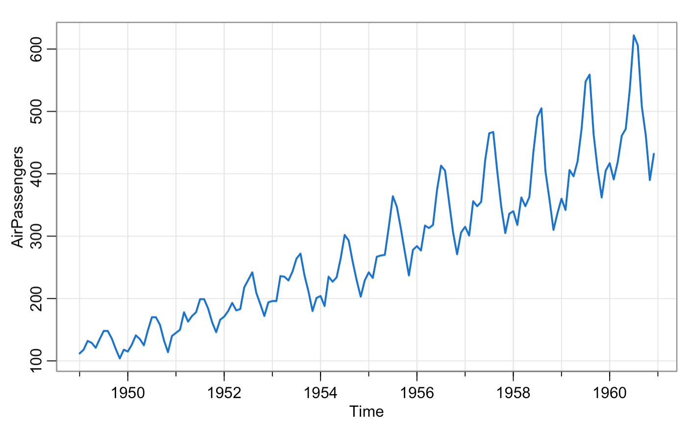
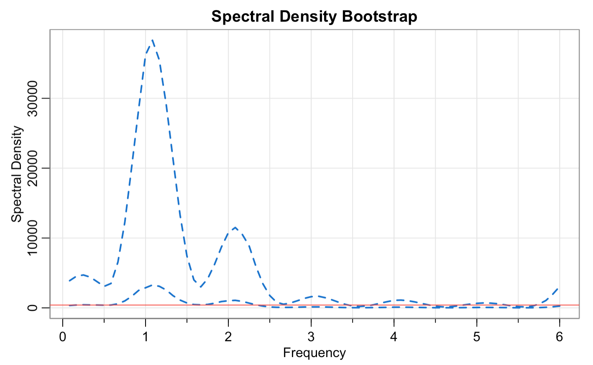

# spec.boots: Bootstrapping Spectral Density 

## Introduction 

In time series spectral analysis, we often want to identify the dominant frequencies (or periods) of the observed series. A periodogram gives us a rough sample estimate of the population spectral density but never gets close to the spectrum as the data size gets large. Nevertheless, we can still construct a nonparametric confidence interval for the spectral density based on the periodogram with a few data assumptions. In reality, data does not always follow these assumptions. That is where bootstrapping spectral density becomes handy. This package implements a bootstrap approach to estimate the spectral density by resampling the periodogram of the original data. 

## Installation 

``` r
# install.packages("devtools")
devtools::install_github("uyenle-gh/spec.boots")
```

## How it works 

The algorithm is as follows: 

1. Centering 

2. Initial Estimate: Compute the periodogram $I(\omega_k) for $k=1, \dots, n$ and a smoothed spectral density $\hat{f}(\omega_k, h) where $h > 0$ is a global bandwidth not dependent on $\omega$.

3. Compute and Rescale Residuals: Compute the residuals $\hat{\epsilon_k} = \frac{I(\omega_k)}{\hat{f}(\omega_k, h)}$ for $k = 1, \dots, n$ and rescale by dividing by the mean residual.

4. Bootstrap Residuals: Resample the residuals $\hat{\epsilon_1}, \dots, \hat{\epsilon_n}$ to get $\hat{\epsilon_1^{*}}$,. 

5. Bootstrap Estimate: Compute a new bootstrap kernel spectral density $\hat{f}^*(\omega_k, h)$ corresponding to the new periodogram $I^*(\omega_k, h) = \hat{f}(\omega_k, h) \hat{\epsilon}_k^*$. 

6. Repeat steps 4 and 5 a large amount of times. 

7. Create a confidence interval for the bootstrap spectral density at all frequencies. 

## Demo

The `spec.boots` function in the package allows us to create a confidence interval for the spectral density of a time series object. 

``` r 
library(spec.boots)
data("AirPassengers")
tsplot(AirPassengers, col=4, lwd=2)
spec.boots(AirPassengers, 1000, c(5,5))
```





## References

Franke, J., and W. Hardle. “On Bootstrapping Kernel Spectral Estimates.” The Annals of Statistics, vol. 20, no. 1, 1992, pp. 121–45. JSTOR, http://www.jstor.org/stable/2242153.

Zoubir, Abdelhak M.. “Bootstrapping spectra: Methods, comparisons and application to knock data”. Signal Process. 90, 5. May, 2010, 1424–1435. https://doi.org/10.1016/j.sigpro.2009.11.030.
